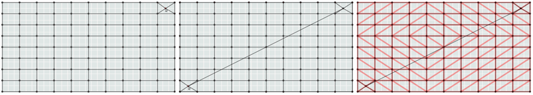
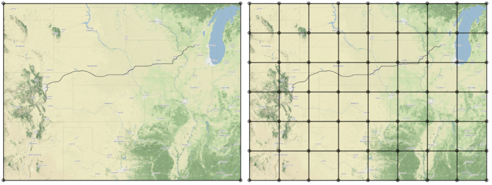
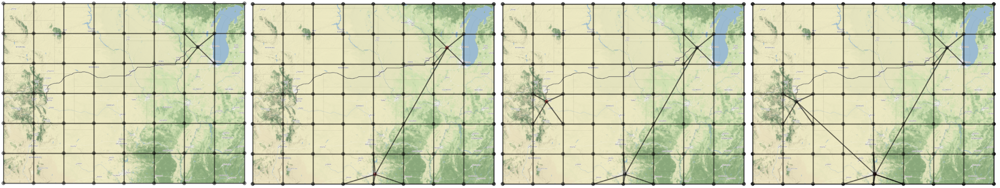
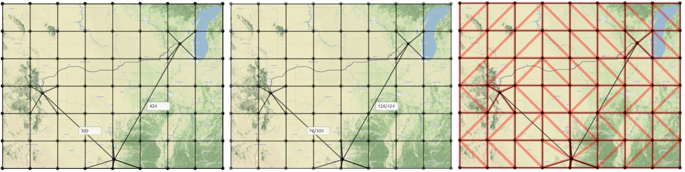
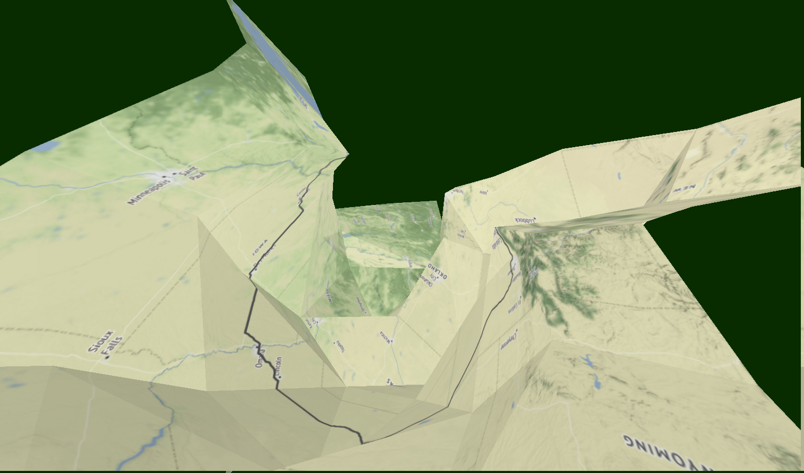
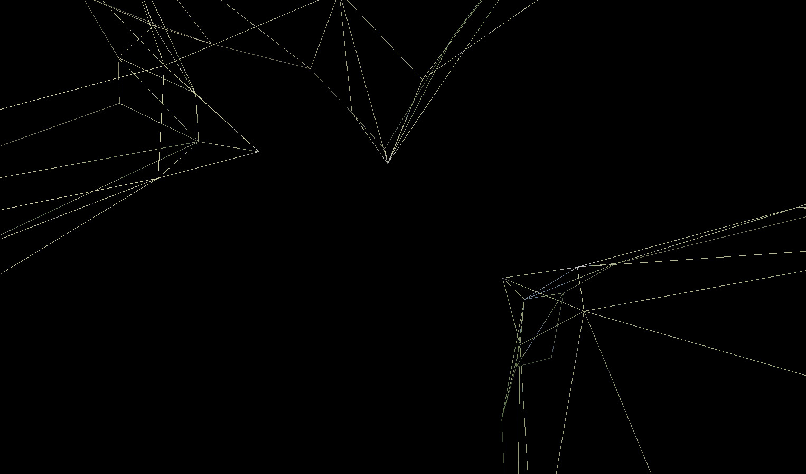
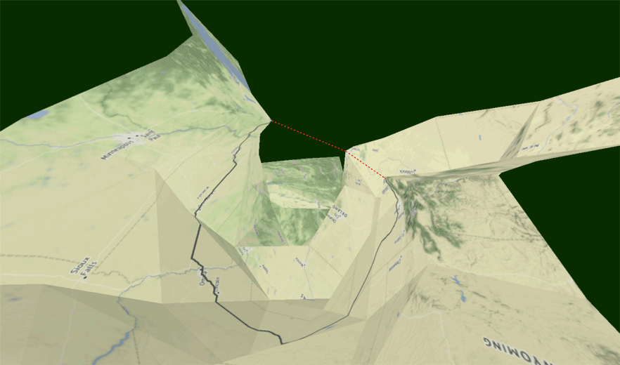

# Distance Demo

## Getting Started
Enfolding allows you to change the distances between two nodes within the editing canvas. This will create a pinch on the maps surface according to new distance you enter. In the image above, with a new edge distance of 0, the two corners are completely cinched together. Here, we will walk you through how to adjust distances and finish with a geographic example from NACIS 2016. A more technical explanation is to come. 
### Add an image to enfolding + create a grid
Here, we are working with a simple grey grid image. Drag and drop whatever image or map you would like to work with into the editing canvas. Add a grid of your choice.

### Create two nodes that connect where you would like to adjust the distance
Create two nodes to get started. You are not limited to just two nodes, but for this example, we are using two.

### Working with the inputs
Be sure to check "show inputs" so that the edge distances appear. All distances are recorded in pixels. Type a new distance in the text box, then hit eneter. Swap over to the rendering canvas to see your changes in 2D and 3D. You can enter new distances and adjust your visualization. 
### Overview
Here is a brief overview of the process before we jump into a geographic example.

## Example: Getting to NACIS 2016
### Add image and grid

### Create nodes and connections between airports

### Adjust distances

### Display in render canvas

### View wireframe

### Add route lines in external program

#### 2D View with no distance changes

#### D View with distance set to zero

#### 3D View with no distance changes

#### 3D View with distance set to zero

#### Zero Distance

