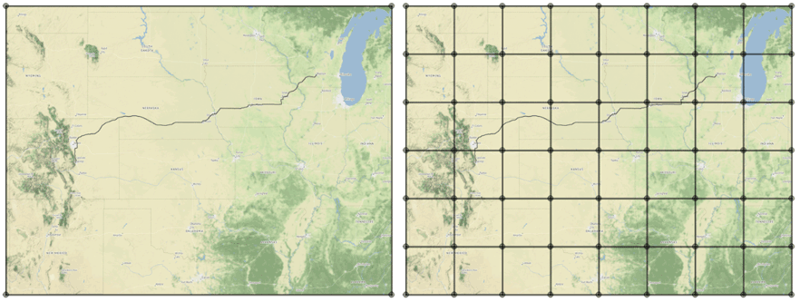
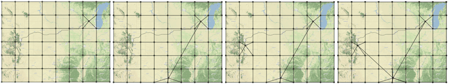
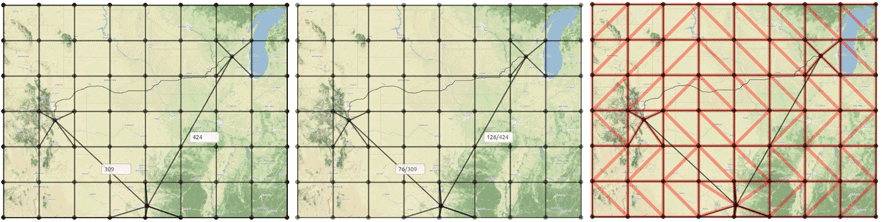
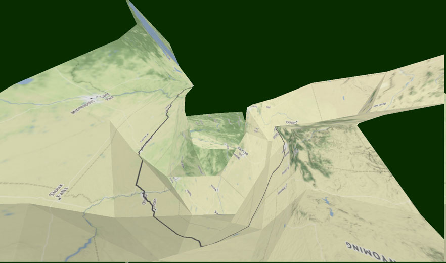

# Distance Demo

## Getting Started
Enfolding allows you to change the distances between two nodes within the editing canvas. This will create a pinch on the maps surface according to the distance you enter. In the image above, with a new edge distance of 0, the two corners are completely cinched together. Here, we will walk you through how to adjust distances and finish with a geographic example from NACIS 2016. A more technical explanation is to come. 
### Add an image to enfolding + create a grid
Here, we are working with a simple grey grid image. Drag and drop whatever image or map you would like to work with into the editing canvas. Add a grid of your choice.

### Create two nodes that connect where you would like to adjust the distance
Create two nodes to get started. You are not limited to just two nodes, but for this example, we are using two.

### Working with the inputs
Be sure to check "show inputs" so that the edge distances appear. All distances are recorded in pixels. Type a new distance in the text box, then hit eneter. Swap over to the rendering canvas to see your changes in 2D and 3D. You can always switch back to edit mode and enter new distances in order to adjust your visualization. 
### Overview
Here is a brief overview of the process before we jump into a geographic example.

## Example: Getting to NACIS 2016
How do different modes of transportation shape these relations across space?
### Add image and grid

### Create nodes and connections between airports
We compared the driving route to flight paths. This specific path transports passengers from Madison to Dallas and then back north to Colorado Springs. After laying out a basic grid, we added a number of nodes to connect these airports and examined their original distances. 

### Adjust distances
Driving time from Madison to Colorado Springs averages around 15 hours, and flight time totals around 4.5 hours in the selected route. We added an extra 2 hours to account for airport waiting and descreased the node distances to reflect the difference between driving and flight times, cinching together the three airport hubs. 

### Display in render canvas
Here’s how it changes in 3D as relations get scaled.
 
### View wireframe

### Add route lines in external program

#### Map tiles used for image by Stamen Design, under CC BY 3.0. Data by OpenStreetMap, under ODbL.

### Additional grey grid renders
#### 2D render with no distance changes

#### 2D render with distance set to zero

#### 3D render with no distance changes

#### 3D render with distance set to zero

#### Zero distance alternative view

