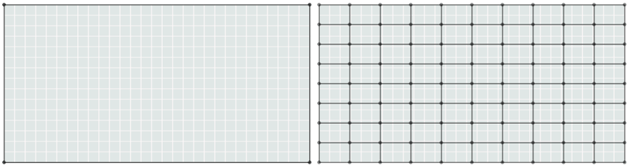
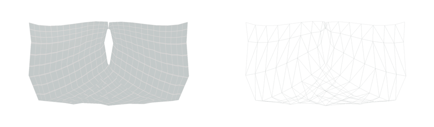
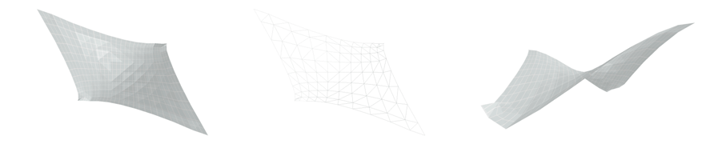
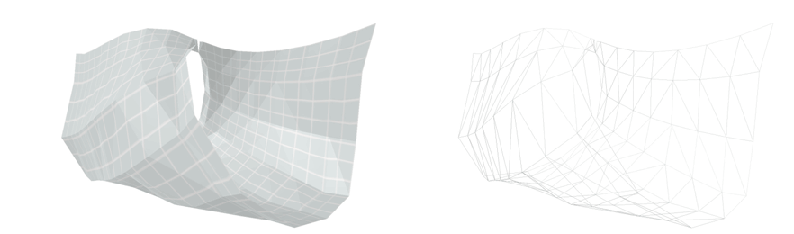

# Distance Demo

## Getting Started
### Add an image to enfolding + create a grid

### Create two nodes that connect where you would like to adjust the distance

## Working with the inputs

#### 2D View with no distance changes

#### D View with distance set to zero

#### 2D View with distance doubled

#### 3D View with no distance changes

#### 3D View with distance set to zero

#### 3D View with distance doubled

#### Zero Distance

