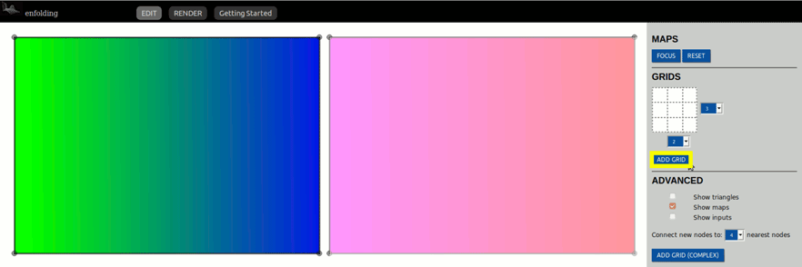

# **An introduction to enfolding: a prototype Geographical Imagination System (GIS)**
  
Table of contents
============
- [Introduction](#introduction)
- [About the interface](#about-the-interface)
    + [Edit Mode](#edit-mode)
    + [Render Mode](#render-mode)
- [Getting Started in Editing Mode](#getting-started-in-editing-mode)
  * [Choosing a file](#choosing-a-file)
  * [Importing your file](#importing-your-file)
  * [Important user notes](#important-user-notes)
    + [Focus](#focus)
    + [Reset](#reset)
  * [Creating Grids and Nodes](#creating-grids-and-nodes)
    + [Grids](#Adding-a-basic-grid)
    + [Nodes](#Adding-nodes)      
  * [Advanced Options](#advanced-options)
- [Rendering your visualization](#rendering-your-visualization)
  * [Map Controls](#map-controls)
    + [3D MODE](#3d-mode)
    + [Two map mode](#two-map-mode)
    + [Rotate](#rotate)
  * [Appearance](#appearance)
    + [Transparency](#transparency)
    + [Background color](#background-color)
  * [Advanced visual options](#advanced-visual-options)
    + [WebVR](#webvr)
    + [Wire frame](#wire-frame)
  * [Exporting your visualization](#exporting-your-visualization)

# **Introduction**
(This will include a little bit of information about the software´s goals, inspiration, the creators, and a bit of info on how the code works)

###### [Current prototype can be found here.](https://foldingspace.github.io/enfolding/)

# About the interface
Enfolding has two canvases, the editing canvas and the rendering canvas. Once you add your maps or layers  to the editing canvas, you may toggle back and forth between editing and rendering as you work. Let´s take a closer look at each of these canvases before getting started.

### Edit Mode
Edit mode is where you will begin your project. Here you will add your maps and begin creating a grid or adding nodes that will shape your map later. We will examine each of these functions in more detail later on in the guide.

### Render Mode
In the rendering canvas, you will be able to view your creation in 2D or 3D, bind maps together, and export your project for use outside of Enfolding.

# **Getting Started in Editing Mode**
To get started with enfolding you will need at least one image. This may be a map, a satellite image, a layer exported from a GIS software, etc.
### Choosing a file
 Enfolding accepts most image formats including .PNG, JPG, .GIF, .SVG, among others. Be sure to save your images, when possible, with a transparent background if there is any white space around them.

To take full advantage of the transparency options in rendering mode, we like to work with SVGs. (Extra tip: you can export your QGIS projects as SVGs. Be sure to select a transparent background. Open them in Inkscape, a free and open sourced program for vector editing to make any final changes or remove unwanted layers.)

### Importing your file
In order to add your image to the canvas, simply drag and drop. You may add up to two images to the editing canvas. The first image you add will be denominated “MAP 1” and the second “MAP 2”. This distinction will be important later on and determine the drawing order of the images. Try out working with a single image first in order to get a handle on the different options within Enfolding.

### Important user notes
You will notice two buttons at the top of the editing menu: “Focus” and “Reset”. As you are creating and adjusting your nodes and grids, these two buttons will be quite important.

- #### Focus 
    You must be focused on an image in order to add or remove nodes and grids. If you are working with two maps or layers, swap back and forth between the two by using the focus button.
    
  

- #### Reset 
    Click the reset button when you are ready to clear all the current nodes or grids from your images. If you would like to delete a current image, refresh the page to start with a blank canvas.

## **Creating Grids and Nodes**
In order to fold, stretch or crinkle your map, you will need to add a grid or individual nodes to the image. 

## Adding a basic grid:
You can add a basic grid by simply selecting its dimensions and clicking add grid. This will generate a new grid on the map in focus. You can tweak this grid later on by adjusting edge distance, creating new nodes, etc. 

  

##### Things to keep in mind: 
In order to bind your maps later, you will need the same number of nodes in each. 
For example, if you add a 3x5 grid in Map 1, you could choose a 5x3 grid in Map 2, or manually add 15 nodes. 

## **Adding Nodes**
Manually add nodes by double clicking the map of interest. By default, the node will make connection to the nearest 4 other nodes. If you would like adjust the number of connections made, simply use the drop-down menu in the advanced settings. The new node will automatically connect to number you selected. 

  

#### Adjusting edge distances
You will notice that as you create nodes, text boxes that display node-node distance appear on each edge. You may adjust these distances in order to stretch or pinch the map. Simply click the box, type a new number, and hit enter. 

In order to change the distance between two particular nodes, click a single node. It will appear in red. Then select another node with a shared edge. The text box will appear and allow you to adjust the distance. 

(GIF or vid to demonstrate)

- **Example 1:** To pinch the map, adjust to 0 and click enter
	(Still image before and after distance decrease)
- **Example 2:** To stretch the map increase the distance and click enter
	(Still image before and after distance increase)
	
	
## **Advanced Options**
  
- ### Show triangles
    Selecting the show triangles option will reveal the triangles created by your grid and node selection.
(Add in little explanation about the triangles)   
- ### Show Maps
    The show maps option allows you to hide or display your maps. All nodes and edges will remain visible.
- ### show inputs
    Check or uncheck the show inputs box if you would like to see or hide the distance text boxes as you create new nodes.
    

# **Rendering your visualization**
Once you have added a grid or drawn a few nodes, switch over to the rendering canvas in order to see how your maps are shaping up. You can always return to make any necessary adjustments.

## **Map Controls**
- ### 3D MODE 
   Your map will automatically render in 2D. Check the box next to 3D in order to view your maps in three dimensions.  
- ### Two map mode 
    If you choose to work with 2 images, check the box next to “Two map mode” to activate other features. Here you may bind the two images together, connecting them by 1-6 nodes. Remember, each image must contain the same number of nodes to bind together successfully.
    (insert GIF with different # of nodes)
- ### Rotate
    Activate the rotation feature below.
    

## **Appearance**
- ### Transparency
    Once you have added a map or maps, you will be able to adjust their transparency using the associated sliders. We have found that this works best with SVGs. 

- ### Background color
    Click any of the colored boxes to adjust the background color of the canvas. 
    

## **Advanced visual options**
- ### WebVR
    If you have a VR headset, get inside your map by checking the box. 
- ### Wire frame
    Reveal the wire framework that sculpts your final map. 
  

## **Exporting your visualization**
We are still developing a number of export options. For now, we have a few recommendations on how to export your enfolded map.

* ### Screen captures
    Use your computer’s screen capture function in order to save an image.
* ### Screen recordings
    Some operating systems automatically offer users the chance to capture a video of your screen. If your do not, many free options exist to do so. 
* ### Export as a 3D object
    If you would like to continue creating within a 3D graphics program like Blender, save your project as an OBJ. 
(Possible example of how and when to use blender)
