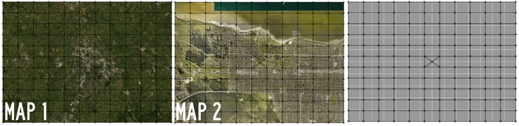
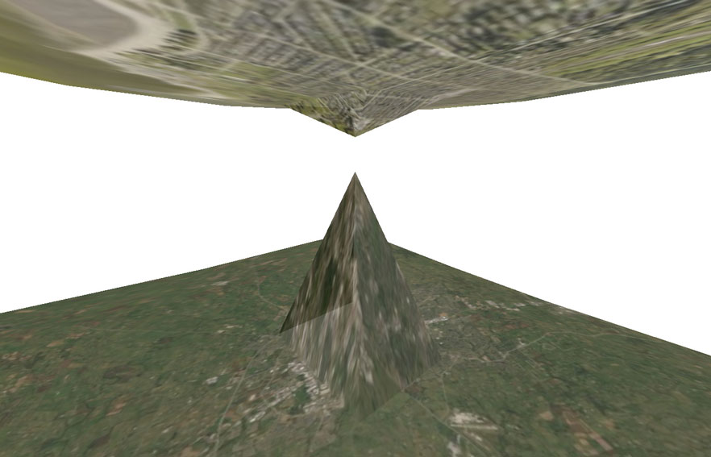
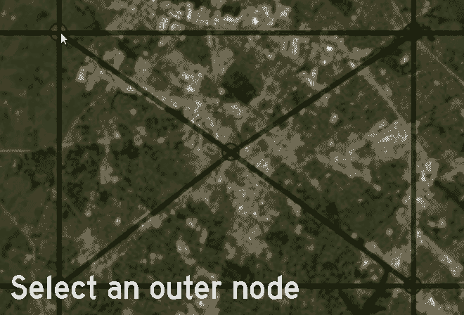

# Wormhole Demo

# How to create a wormhole with enfolding

## **Editing Canvas**
### Step 1: Add two maps to enfolding 
To get started you will need two images. Drag and drop each into the enfolding editing canvas.
### Step 2: Create a grid
Before the images can be bound together to form the wormhole, you must create a grid. We suggest creating a grid with an odd number of nodes. For this demo we will show you the results from a 5x5 grid and an 11x11 grid.  
**5x5 Grid**
 
**11x11 Grid**

### Step 3: Add a node in the center of the grid
To complete the nodes for the wormhole visualization, add a single node in the middle square of the grid. Be sure that this node connects with the four nearest nodes. You can adjust this in the advanced settings. Simply double click to create the new node.  
**5x5 Grid**  
 
**11x11 Grid**  
 
## **Rendering Canvas**	
### Step 4: Swap to render mode.  
**5x5 Grid**  
You will notice a 2D version of your images is displayed. The wireframe to the right displays the delaunay triangles created within the grid. 
 
**11x11 Grid**  
Notice how the 11x11 grid shows smoother edges. This will impact your 3D visualization later on. 
  
### Step 5: Activate 3D View
Activate the 3D view within the map controls by checking the box. Use your mouse to drag or rotate the image, or active rotation to get a detailed look at the 3D rendering.

**5x5 Grid**
 
**11x11 Grid**  
Once again you will notice that both the 5x5 and 11x11 grids have similar structures and shapes. However, the 11x11 provides a gentler transition between squares. Choose a grid with fewer squares if you are aiming for a more blocky visual.
 
### Step 6: Check two map mode
Checking the two map mode box will unlock the controls needed to create the final wormhole. 

### Step 7: Bind maps by the last node
Once you activate Two Map Mode, bind the maps together. While the dropdown menu allows you to connect several nodes, for this case select 1 node.
#### And .... You have a wormhole! 
**5x5 Grid**

**11x11 Grid**  
Now, we see how our initial grid selection can effect the outcome of the bound maps. Feel free to toggle back to editting mode and switch up your grid if you are not satisfied with the initial shape.

### Step 8: Adjust and Export
#### Play with transparency Levels
Adjust the transparency and take advantage of the rotation object to create and export images of your final project. 

#### Export
The "SAVE IMAGE" button creates and downloads a .JPG of your current view. The "SAVE OBJ" button generates and .OBJ file for use in blender. If you would like to export a rotating version of your visualizations, we encourage you to use a screen capture or recording application. 
## Advanced Options
### Altering the relation between the two images
In the previous versions, you note that the wormhole height is equal in both MAP 1 and MAP 2. You can adjust this by increasing or decreasing the distances of each edge that connects to the central node of your grid. Let's take a closer look. We imagine this may be useful in representing unequal connections, extractive relationships, etc. 

### Step 1: Swap back to the Editing Canvas
### Step 2: Focus on the map you will like to edge by using the "FOCUS" button. 
This will allow you to add nodes and adjust edge distances. 
### Step 3: Adjust edge distances. 
- Click on an outer node that connects with the central node. 
Here, we will only be adjusting the edge distances for the central block of the grid where we added the central node earlier. You will see a text box appear. 
- Type a new value. 
If you would like to stretch the wormhole, select a higher value. If you would like to compress it, select a lower valie. Here, we chose to double the edges from around 125 to 250. 
- Repeat for all four edges. 

### Step 4: Return to the Rendering Canvas to view the results
These two examples were made using the 5x5 grid. Examine how the dynamic shifts when editing MAP 1 and MAP 2. 
#### MAP 1 with exagerated edge distances around the central node

#### MAP 2 with exagerated edge distances around the central node

# Why create a wormhole with enfolding?

